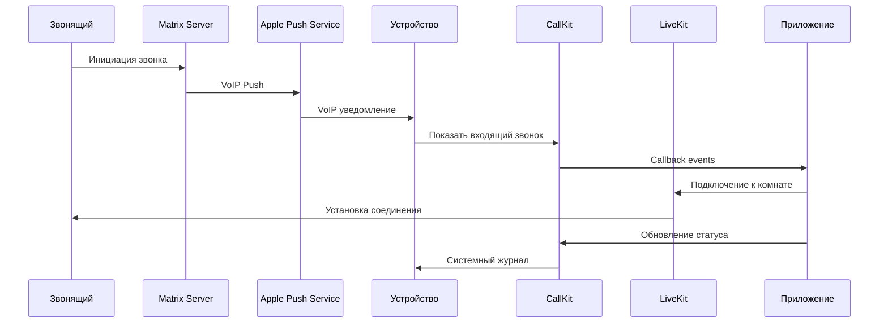

# 📞 План интеграции VoIP звонков с CallKit

## 🎯 Цель
Реализовать полноценную интеграцию VoIP звонков с нативным интерфейсом iOS CallKit, включая правильные push уведомления, системный журнал звонков и уведомления о пропущенных звонках.

## 📋 Текущие проблемы
1. **Push уведомления**: Приходят как "New Message" вместо VoIP push с CallKit
2. **Нет CallKit интеграции**: Входящие звонки не показывают нативный интерфейс iOS
3. **Системный журнал**: Звонки не попадают в системный журнал телефона
4. **Пропущенные звонки**: Отсутствуют уведомления о пропущенных звонках
5. **Журнал приложения**: Недостаточно метаданных о звонках

## 🏗️ Архитектура решения

### 1. VoIP Push Notifications
```
Matrix Server → APNS VoIP Push → iOS Device → CallKit → Native UI
```

### 2. Компоненты системы
- **LiveKitCallService**: Управление LiveKit соединениями
- **LiveKitCallKitService**: Интеграция с CallKit
- **VoIPPushHandler**: Обработка VoIP push уведомлений
- **CallHistoryManager**: Управление журналом звонков
- **CallNotificationService**: Уведомления о звонках

## 📊 Диаграмма потока звонка



## 🔧 Технические требования

### 1. VoIP Push Certificates
- [x] VoIP push certificate настроен
- [x] Matrix server поддерживает VoIP push
- [ ] Правильный payload для CallKit

### 2. CallKit Integration
- [ ] CXProvider для управления звонками
- [ ] CXCallController для контроля звонков
- [ ] Правильные метаданные (display name, handle)
- [ ] Поддержка audio/video звонков

### 3. Push Payload Format
```json
{
  "aps": {
    "alert": {
      "title": "Входящий звонок",
      "body": "testuser2"
    },
    "sound": "default",
    "category": "INCOMING_CALL"
  },
  "call_id": "BC7D9F4E-D1CE-4B36-B765-A3484615C4D9",
  "caller_id": "@testuser2:matrix.aibots.kz",
  "caller_name": "testuser2",
  "call_type": "video",
  "room_id": "!roomId:matrix.aibots.kz",
  "voip": true
}
```

## 📝 План реализации

### Phase 1: Анализ текущей архитектуры ⏳
- [x] Изучить LiveKitCallService
- [x] Изучить LiveKitCallKitService  
- [x] Изучить NotificationServiceExtension
- [ ] Найти точки интеграции

### Phase 2: Push уведомления 🔄
- [ ] Модифицировать NSE для VoIP push
- [ ] Обновить payload processing
- [ ] Добавить CallKit triggers
- [ ] Тестирование push уведомлений

### Phase 3: CallKit интеграция 🔄
- [ ] Настроить CXProvider
- [ ] Реализовать CXProviderDelegate
- [ ] Интегрировать с LiveKit
- [ ] Обработка answer/decline
- [ ] Metadata и display names

### Phase 4: Системный журнал 🔄
- [ ] CallKit automatically logs calls
- [ ] Verify call metadata
- [ ] Test system call log

### Phase 5: Журнал приложения 🔄
- [ ] Расширить CallLogViewModel
- [ ] Добавить метаданные
- [ ] Синхронизация с CallKit
- [ ] UI обновления

### Phase 6: Пропущенные звонки 🔄
- [ ] Детект пропущенных звонков
- [ ] Local notifications
- [ ] Badge updates
- [ ] Persistence

## 🔍 Ключевые файлы для модификации

### Core Services
- `ElementX/Sources/Services/LiveKit/LiveKitCallService.swift`
- `ElementX/Sources/Services/LiveKit/LiveKitCallKitService.swift`
- `NSE/Sources/NotificationServiceExtension.swift`

### UI Components  
- `ElementX/Sources/Screens/HomeScreen/View/HomeScreen.swift` (CallLogView)
- Call history models и view models

### Configuration
- Push notification entitlements
- Info.plist configuration

## 🧪 План тестирования

### 1. Unit Tests
- [ ] VoIP push processing
- [ ] CallKit integration
- [ ] Call history management

### 2. Integration Tests
- [ ] End-to-end call flow
- [ ] Push → CallKit → LiveKit
- [ ] Call logging

### 3. Manual Tests
- [ ] Incoming calls UI
- [ ] System call log
- [ ] Missed call notifications
- [ ] Cross-device testing

## 📚 Документация референсы

### Apple Documentation
- [CallKit Framework](https://developer.apple.com/documentation/callkit)
- [VoIP Push Notifications](https://developer.apple.com/documentation/pushkit)
- [PushKit Framework](https://developer.apple.com/documentation/pushkit)

### Matrix/LiveKit
- [Matrix Call Events](https://spec.matrix.org/v1.8/client-server-api/#voice-over-ip)
- [LiveKit Swift SDK](https://docs.livekit.io/realtime/client/ios/)
- [Matrix Rust SDK](https://matrix-org.github.io/matrix-rust-sdk/)

### Best Practices
- [iOS VoIP Best Practices](https://developer.apple.com/library/archive/documentation/Performance/Conceptual/EnergyGuide-iOS/OptimizeVoIP.html)
- [CallKit Best Practices](https://developer.apple.com/videos/play/wwdc2016/230/)

## ⚠️ Ограничения и соображения

### Технические ограничения
- VoIP push требует активного network connection
- CallKit имеет строгие requirements для метаданных
- Background execution limitations

### Безопасность
- End-to-end encryption compatibility
- Metadata privacy considerations
- Push payload security

### UX Considerations
- Native iOS call experience
- Accessibility support
- Internationalization

---

**Дата создания**: 2025-08-04  
**Автор**: Claude Code Assistant  
**Статус**: В разработке  