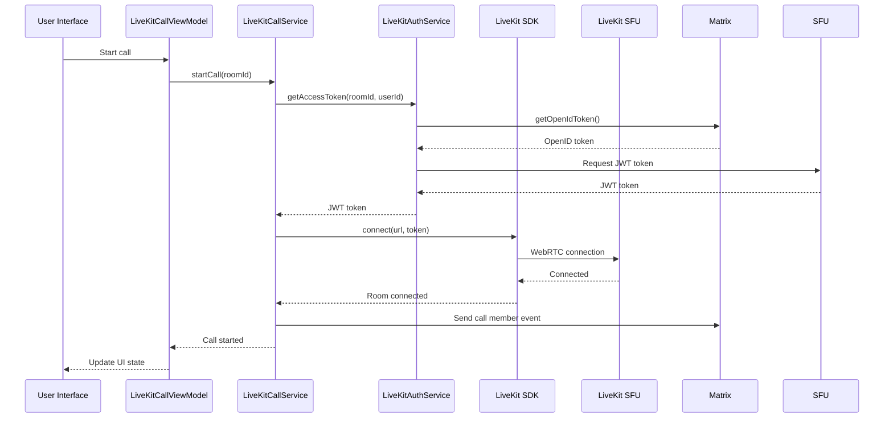
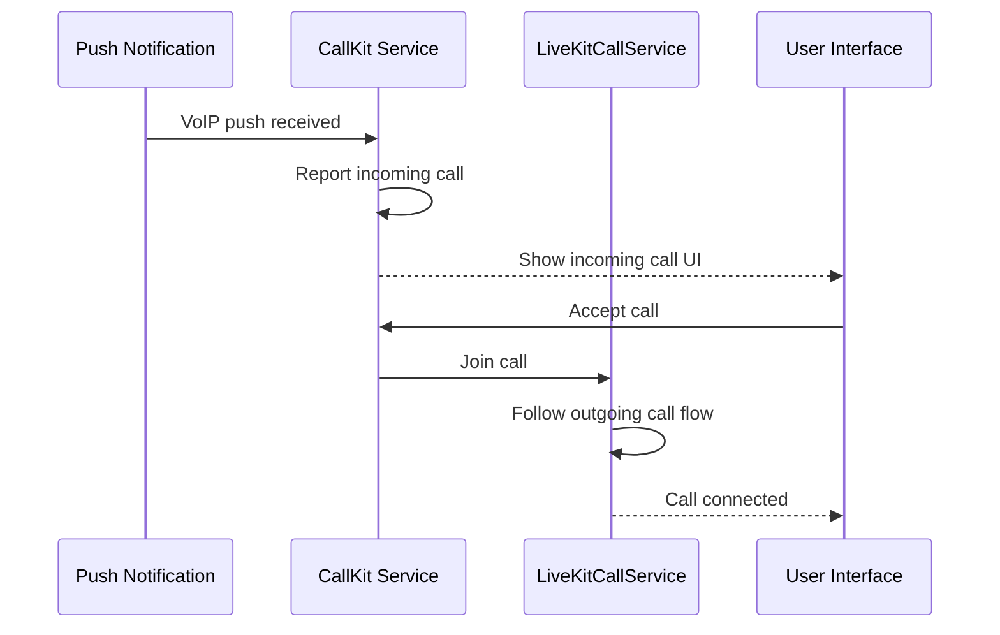

# LiveKit Architecture для ElementX iOS

## 🏗 Архитектурная схема

### Текущая архитектура (Element Call):
```
┌─────────────────┐    ┌─────────────────┐    ┌─────────────────┐
│   ElementX iOS  │────│  Widget API     │────│  Element Call   │
│                 │    │  (WebView)      │    │  (Web App)      │
│  ┌───────────┐  │    │                 │    │                 │
│  │ CallKit   │  │    │                 │    │  ┌───────────┐  │
│  └───────────┘  │    │                 │    │  │ LiveKit   │  │
│                 │    │                 │    │  │ WebRTC    │  │
│  ┌───────────┐  │    │                 │    │  └───────────┘  │
│  │ Native UI │  │    │                 │    │                 │
│  └───────────┘  │    │                 │    │                 │
└─────────────────┘    └─────────────────┘    └─────────────────┘
```

### Новая архитектура (Native LiveKit):
```
┌─────────────────┐    ┌─────────────────┐    ┌─────────────────┐
│   ElementX iOS  │────│  LiveKit SDK    │────│  LiveKit SFU    │
│                 │    │  (Native)       │    │  (video.aibots) │
│  ┌───────────┐  │    │                 │    │                 │
│  │ CallKit   │◄─┼────┼─ Call Service   │    │                 │
│  └───────────┘  │    │                 │    │                 │
│                 │    │                 │    │                 │
│  ┌───────────┐  │    │                 │    │                 │
│  │ Native UI │◄─┼────┼─ LiveKit Views  │    │                 │
│  └───────────┘  │    │                 │    │                 │
└─────────────────┘    └─────────────────┘    └─────────────────┘
```

## 📱 Слои приложения

### 1. **Presentation Layer** (SwiftUI Views)
```swift
LiveKitCallScreen
├── ParticipantsGridView
├── LocalVideoView  
├── CallControlsView
│   ├── MuteButton
│   ├── VideoButton
│   ├── SpeakerButton
│   └── HangupButton
└── CallInfoView
```

### 2. **Business Logic Layer** (ViewModels & Services)
```swift
LiveKitCallViewModel
├── LiveKitCallService
│   ├── Room management
│   ├── Participant tracking
│   └── Media controls
├── LiveKitAuthService
│   ├── JWT token generation
│   └── Matrix OpenID integration
└── LiveKitCallKitService
    ├── Incoming calls
    ├── Call UI integration
    └── System audio routing
```

### 3. **Data Layer** (LiveKit SDK & Matrix)
```swift
LiveKit SDK
├── Room connection
├── Media tracks
├── Participant management
└── WebRTC handling

Matrix Integration  
├── Call member events
├── OpenID tokens
└── Room state sync
```

## 🔄 Call Flow Диаграммы

### Исходящий звонок (Outgoing Call):


### Входящий звонок (Incoming Call):


## 🎯 Ключевые компоненты

### LiveKitCallService
```swift
final class LiveKitCallService: ObservableObject {
    // MARK: - Properties
    private let room = Room()
    private let authService: LiveKitAuthService
    private let matrixClient: MatrixClient
    
    @Published var isConnected = false
    @Published var participants: [Participant] = []
    @Published var localParticipant: LocalParticipant?
    
    // MARK: - Public Methods
    func startCall(roomId: String) async throws {
        let token = try await authService.getAccessToken(roomId: roomId)
        try await room.connect(url: liveKitServerURL, token: token)
        await sendCallMemberEvent(roomId: roomId)
    }
    
    func endCall() async throws {
        try await room.disconnect()
        await removeCallMemberEvent()
    }
    
    // MARK: - Media Controls
    func toggleMicrophone() async throws {
        guard let localParticipant = room.localParticipant else { return }
        try await localParticipant.setMicrophone(enabled: !localParticipant.isMicrophoneEnabled())
    }
    
    func toggleCamera() async throws {
        guard let localParticipant = room.localParticipant else { return }
        try await localParticipant.setCamera(enabled: !localParticipant.isCameraEnabled())
    }
}
```

### LiveKitAuthService
```swift
final class LiveKitAuthService {
    private let httpClient: HTTPClient
    private let matrixClient: MatrixClient
    
    func getAccessToken(roomId: String) async throws -> String {
        // 1. Получить OpenID токен от Matrix
        let openIdResponse = try await matrixClient.requestOpenIdToken()
        
        // 2. Обменять на LiveKit JWT токен
        let authRequest = LiveKitAuthRequest(
            roomId: roomId,
            participantName: matrixClient.userId,
            openIdToken: openIdResponse.accessToken
        )
        
        let response = try await httpClient.post(
            url: "\(liveKitAuthURL)/api/auth",
            body: authRequest
        )
        
        return response.accessToken
    }
}
```

### LiveKitCallScreen
```swift
struct LiveKitCallScreen: View {
    @StateObject private var viewModel: LiveKitCallViewModel
    @State private var isPiPActive = false
    
    var body: some View {
        ZStack {
            // Background
            Color.black.ignoresSafeArea()
            
            // Participants grid
            ParticipantsGridView(participants: viewModel.participants)
            
            // Local video (Picture-in-Picture)
            if let localParticipant = viewModel.localParticipant {
                LocalVideoView(participant: localParticipant)
                    .frame(width: 120, height: 160)
                    .cornerRadius(12)
                    .position(x: UIScreen.main.bounds.width - 80, y: 120)
            }
            
            // Call controls
            VStack {
                Spacer()
                CallControlsView(
                    isMuted: $viewModel.isMuted,
                    isVideoEnabled: $viewModel.isVideoEnabled,
                    onHangup: { viewModel.endCall() }
                )
                .padding(.bottom, 50)
            }
        }
        .onAppear { viewModel.startCall() }
        .onDisappear { viewModel.endCall() }
    }
}
```

## 🔐 Security & Permissions

### Требуемые разрешения:
```xml
<!-- Info.plist -->
<key>NSCameraUsageDescription</key>
<string>Camera access is required for video calls</string>

<key>NSMicrophoneUsageDescription</key>  
<string>Microphone access is required for voice calls</string>

<key>UIBackgroundModes</key>
<array>
    <string>voip</string>
    <string>audio</string>
</array>
```

### JWT Token Security:
- OpenID токены от Matrix homeserver
- Короткий TTL для JWT токенов (1 час)
- Безопасная передача через HTTPS
- Валидация токенов на LiveKit SFU

## 📊 Performance Optimizations

### Memory Management:
```swift
extension LiveKitCallService {
    func optimizeForBattery() {
        // Reduce video quality when on battery
        room.localParticipant?.setVideoQuality(.low)
    }
    
    func handleAppBackground() {
        // Disable video when app goes to background
        room.localParticipant?.setCamera(enabled: false)
    }
    
    func handleAppForeground() {
        // Re-enable video when app comes to foreground
        room.localParticipant?.setCamera(enabled: true)
    }
}
```

### Video Rendering:
- Hardware acceleration через Metal
- Adaptive bitrate для network conditions
- Efficient participant layout management
- Memory-efficient video track handling

## 🧪 Testing Strategy

### Unit Tests:
```swift
class LiveKitCallServiceTests: XCTestCase {
    func testCallInitiation() async throws {
        let service = LiveKitCallService(authService: mockAuthService)
        try await service.startCall(roomId: "test-room")
        XCTAssertTrue(service.isConnected)
    }
    
    func testMicrophoneToggle() async throws {
        // Test microphone controls
    }
    
    func testCallTermination() async throws {
        // Test proper cleanup
    }
}
```

### Integration Tests:
- End-to-end call scenarios
- CallKit integration testing  
- Push notification handling
- Matrix event synchronization

### UI Tests:
- Call screen interactions
- PiP mode transitions
- Error state handling
- Accessibility compliance

## 🔧 Configuration

### LiveKit Settings:
```swift
struct LiveKitConfig {
    static let serverURL = "wss://video.aibots.kz"
    static let authURL = "https://video.aibots.kz/api/auth"
    
    static let videoConfig = VideoConfiguration(
        dimensions: .h720_169,
        encoding: .h264
    )
    
    static let audioConfig = AudioConfiguration(
        noiseSuppression: true,
        echoCancellation: true
    )
}
```

Эта архитектура обеспечивает:
- 🚀 **Высокую производительность** через нативную реализацию
- 🔒 **Безопасность** через Matrix OpenID и JWT токены  
- 🎨 **Гибкость UI** через нативные SwiftUI компоненты
- 🔧 **Простоту интеграции** с существующей кодовой базой