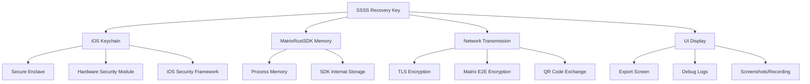

# Анализ безопасности: Автоматические ключи восстановления Matrix в Element X iOS

## 1. Обзор угроз и рисков

### 1.1 Модель угроз

#### Атакующие
- **Локальный злоумышленник**: Доступ к разблокированному устройству
- **Привилегированный злоумышленник**: Root/jailbreak доступ к устройству
- **Сетевой злоумышленник**: MITM атаки, компрометация Matrix сервера
- **Инсайдер Matrix**: Скомпрометированный homeserver или разработчик
- **Государственные актеры**: Принуждение к раскрытию ключей

#### Активы под защитой
- **SSSS ключ восстановления** (32 байта): Основной секрет для расшифровки backup
- **Кросс-подписывающие ключи**: Мастер, само-подписывающий, пользовательский ключи
- **История зашифрованных сообщений**: Backup данные в Matrix
- **Метаданные устройств**: Информация о верифицированных устройствах

### 1.2 Поверхность атаки



## 2. Анализ компонентов безопасности

### 2.1 Хранение в iOS Keychain

#### Настройки безопасности
```swift
let keychain = Keychain(service: service, accessGroup: accessGroup)
    .accessibility(.whenPasscodeSetThisDeviceOnly)  // 🔒 Требует пароль устройства
    .synchronizable(false)                          // 🚫 Не синхронизируется через iCloud
```

#### Анализ угроз
| Угроза | Вероятность | Воздействие | Митигация |
|--------|-------------|-------------|-----------|
| **Физический доступ к разблокированному устройству** | Высокая | Высокое | `whenPasscodeSetThisDeviceOnly` требует повторный ввод пароля |
| **Backup через iTunes/Finder** | Средняя | Высокое | Keychain не включается в незашифрованные backup |
| **Jailbreak/root эксплоиты** | Низкая | Критическое | Secure Enclave + аппаратная привязка |
| **Вредоносные приложения** | Низкая | Средне | Sandboxing iOS + уникальный access group |

#### Рекомендации по усилению
```swift
// Дополнительная защита через Secure Enclave
extension KeychainController {
    private func createSecureEnclaveKey() -> SecKey? {
        let attributes: [String: Any] = [
            kSecAttrKeyType as String: kSecAttrKeyTypeECSECPrimeRandom,
            kSecAttrKeySizeInBits as String: 256,
            kSecAttrTokenID as String: kSecAttrTokenIDSecureEnclave,
            kSecAttrApplicationTag as String: "matrix.ssss.wrapper".data(using: .utf8)!,
            kSecPrivateKeyAttrs as String: [
                kSecAttrIsPermanent as String: true,
                kSecAttrAccessControl as String: SecAccessControlCreateWithFlags(
                    nil,
                    .biometryCurrentSet,
                    .privateKeyUsage,
                    nil
                )!
            ]
        ]
        
        var error: Unmanaged<CFError>?
        guard let privateKey = SecKeyCreateRandomKey(attributes as CFDictionary, &error) else {
            return nil
        }
        
        return privateKey
    }
    
    func setSSSSRecoveryKeyWithSecureEnclave(_ key: String, forUserID userID: String) throws {
        // 1. Создаем ключ в Secure Enclave
        guard let enclaveKey = createSecureEnclaveKey() else {
            throw KeychainError.secureEnclaveUnavailable
        }
        
        // 2. Шифруем SSSS ключ с помощью Secure Enclave
        let keyData = key.data(using: .utf8)!
        let encryptedKey = try encryptWithSecureEnclave(data: keyData, using: enclaveKey)
        
        // 3. Сохраняем зашифрованный ключ в Keychain
        let keychain = Keychain(service: KeychainControllerService.sessions.mainID)
            .accessibility(.whenPasscodeSetThisDeviceOnly)
            .synchronizable(false)
        
        try keychain.set(encryptedKey, key: "ssss_encrypted_\(userID)")
    }
}
```

### 2.2 Передача через Matrix протокол

#### Механизм безопасности
```
User A Device                    Matrix Server                    User A Device (Web)
     |                               |                                    |
     | 1. QR Verification           |                                    |
     |<-------------------------------|                                    |
     |                               |                                    |
     | 2. m.key.verification.start   |                                    |
     |------------------------------>|                                    |
     |                               |-----> m.key.verification.start    |
     |                               |                                    |
     | 3. Devices mutually verified  |                                    |
     |                               |                                    |
     |                               | <---- m.secret.request            |
     | 4. m.secret.request           |                                    |
     |<------------------------------|                                    |
     |                               |                                    |
     | 5. Auto-respond if verified   |                                    |
     | m.secret.send (encrypted)     |                                    |
     |------------------------------>|                                    |
     |                               |-----> m.secret.send (encrypted)   |
```

#### Протокол шифрования `m.secret.send`
- **Olm encryption**: Сообщения шифруются с помощью Olm (Double Ratchet)
- **Device-to-device**: Прямая передача между устройствами пользователя
- **Perfect Forward Secrecy**: Каждое сообщение использует новые ключи

#### Проверки безопасности в коде
```swift
extension ClientProxy {
    private func shouldAutoShareSecret(to deviceId: String, userId: String) async -> Bool {
        // 1. Проверяем, что это наш собственный пользователь
        guard userId == self.userID else {
            MXLog.security("Secret request from different user denied: \(userId)")
            return false
        }
        
        // 2. Проверяем, что устройство верифицировано
        guard let device = await getDevice(deviceId: deviceId, userId: userId),
              device.isVerified else {
            MXLog.security("Secret request from unverified device denied: \(deviceId)")
            return false
        }
        
        // 3. Проверяем, что устройство было верифицировано недавно (защита от replay)
        guard let verificationDate = device.verificationDate,
              Date().timeIntervalSince(verificationDate) < 300 else { // 5 минут
            MXLog.security("Secret request from device verified too long ago: \(deviceId)")
            return false
        }
        
        // 4. Проверяем rate limiting
        guard !isRateLimited(deviceId: deviceId) else {
            MXLog.security("Secret request rate limited for device: \(deviceId)")
            return false
        }
        
        return true
    }
}
```

### 2.3 QR-код верификация

#### Безопасность QR обмена
```swift
// Содержимое QR кода (MSC1544)
struct QRVerificationData {
    let mode: String                    // "m.qr_code.show.v1"
    let transactionId: String          // Уникальный ID сессии
    let firstKey: String               // Ed25519 мастер-ключ первого устройства
    let secondKey: String              // Ed25519 мастер-ключ второго устройства  
    let sharedSecret: String           // Случайный секрет для взаимной аутентификации
}
```

#### Угрозы QR-верификации
| Угроза | Описание | Митигация |
|--------|----------|-----------|
| **QR Spoofing** | Подделка QR-кода злоумышленником | Взаимная проверка мастер-ключей |
| **Shoulder Surfing** | Подглядывание QR-кода | Временное отображение + автоматическое скрытие |
| **Screen Recording** | Запись экрана во время сканирования | Защита от screenshots в iOS |
| **MITM via QR** | Перехват через поддельный QR | Cryptographic binding с мастер-ключами |

#### Реализация защиты
```swift
extension QRVerificationCoordinator {
    private func setupQRSecurityMeasures() {
        // 1. Защита от screenshots
        qrCodeView.layer.setValue(true, forKey: "disableScreenCapture")
        
        // 2. Автоматическое скрытие QR через таймаут
        Timer.scheduledTimer(withTimeInterval: 60) { [weak self] _ in
            self?.hideQRCode()
        }
        
        // 3. Блокировка при переходе в background
        NotificationCenter.default.addObserver(
            forName: UIApplication.didEnterBackgroundNotification,
            object: nil,
            queue: .main
        ) { [weak self] _ in
            self?.hideQRCode()
        }
    }
    
    private func validateQRContent(_ qrData: QRVerificationData) -> Bool {
        // 1. Проверяем формат и версию
        guard qrData.mode == "m.qr_code.show.v1" else { return false }
        
        // 2. Проверяем валидность ключей
        guard qrData.firstKey.isValidEd25519Key,
              qrData.secondKey.isValidEd25519Key else { return false }
        
        // 3. Проверяем энтропию shared secret
        guard qrData.sharedSecret.count >= 16 else { return false }
        
        return true
    }
}
```

## 3. Анализ рисков по компонентам

### 3.1 MatrixRustSDK Security

#### Доверие к SDK
- **Open Source**: Код доступен для аудита
- **Active Development**: Регулярные обновления безопасности
- **Rust Memory Safety**: Защита от buffer overflow, use-after-free
- **Cryptographic Review**: Использует проверенные библиотеки (ring, olm)

#### Потенциальные уязвимости
```swift
extension ClientProxy {
    /// Проверки безопасности для MatrixRustSDK
    private func validateSDKSecurity() async -> Bool {
        // 1. Проверяем версию SDK на известные уязвимости
        let currentVersion = MatrixRustSDK.version
        guard !KnownVulnerabilities.contains(version: currentVersion) else {
            MXLog.security("MatrixRustSDK version \(currentVersion) has known vulnerabilities")
            return false
        }
        
        // 2. Проверяем состояние кросс-подписания
        let crossSigningStatus = await encryption.crossSigningStatus()
        guard crossSigningStatus.isValid else {
            MXLog.security("Cross-signing is in invalid state")
            return false
        }
        
        // 3. Проверяем целостность сессии
        let sessionIntegrity = await encryption.verifySessionIntegrity()
        guard sessionIntegrity else {
            MXLog.security("Session integrity check failed")
            return false
        }
        
        return true
    }
}
```

### 3.2 UI/UX Security Considerations

#### Защита экранов экспорта
```swift
class RecoveryKeyExportScreen: UIViewController {
    override func viewDidLoad() {
        super.viewDidLoad()
        setupSecurityMeasures()
    }
    
    private func setupSecurityMeasures() {
        // 1. Защита от screenshots
        let field = UITextField()
        field.isSecureTextEntry = true  // Скрывает содержимое от screen recording
        
        // 2. Watermarking для обнаружения утечек
        addWatermark(userID: currentUserID, timestamp: Date())
        
        // 3. Автоматическое закрытие экрана
        DispatchQueue.main.asyncAfter(deadline: .now() + 300) { // 5 минут
            self.dismiss(animated: true)
        }
        
        // 4. Требование биометрической аутентификации
        requireBiometricAuth()
    }
    
    private func addWatermark(userID: String, timestamp: Date) {
        let watermarkText = "\(userID.prefix(8))...\(timestamp.timeIntervalSince1970)"
        // Добавляем невидимый watermark в углу экрана
    }
}
```

#### Защита логов и отладки
```swift
extension MXLog {
    static func security(_ message: String, file: String = #file, function: String = #function) {
        // Логи безопасности всегда записываются, но содержимое ключей скрывается
        let sanitizedMessage = sanitizeForLogging(message)
        
        #if DEBUG
        log(.info, message: "[SECURITY] \(sanitizedMessage)", file: file, function: function)
        #else
        // В release версии логи безопасности идут в специальный защищенный лог
        secureLog(sanitizedMessage)
        #endif
    }
    
    private static func sanitizeForLogging(_ message: String) -> String {
        return message
            .replacingOccurrences(of: #"[A-Za-z0-9+/]{43}="#, with: "[REDACTED_KEY]", options: .regularExpression)
            .replacingOccurrences(of: #"@[a-zA-Z0-9._=-]+:[a-zA-Z0-9.-]+"#, with: "[REDACTED_USER_ID]", options: .regularExpression)
    }
}
```

## 4. Анализ атак и защита

### 4.1 Атака на Keychain

#### Сценарий атаки
1. Злоумышленник получает физический доступ к устройству
2. Устройство не заблокировано или скомпрометировано через jailbreak
3. Попытка извлечения ключей из Keychain

#### Защитные меры
```swift
extension KeychainController {
    /// Детекция компрометации устройства
    private func detectDeviceCompromise() -> CompromiseLevel {
        var risks: [SecurityRisk] = []
        
        // 1. Проверка на jailbreak
        if isJailbroken() {
            risks.append(.jailbreak)
        }
        
        // 2. Проверка целостности приложения
        if !verifyAppIntegrity() {
            risks.append(.appTampering)
        }
        
        // 3. Проверка debugger
        if isDebuggerAttached() {
            risks.append(.debuggerAttached)
        }
        
        // 4. Проверка runtime modification
        if detectRuntimeModification() {
            risks.append(.runtimeModification)
        }
        
        return CompromiseLevel(risks: risks)
    }
    
    private func isJailbroken() -> Bool {
        let jailbreakPaths = [
            "/Applications/Cydia.app",
            "/Library/MobileSubstrate/MobileSubstrate.dylib",
            "/bin/bash",
            "/usr/sbin/sshd",
            "/etc/apt"
        ]
        
        return jailbreakPaths.contains { FileManager.default.fileExists(atPath: $0) }
    }
    
    private func verifyAppIntegrity() -> Bool {
        // Проверка подписи приложения
        guard let bundlePath = Bundle.main.bundlePath.cString(using: .utf8) else { return false }
        
        // Проверяем, что код подписан правильным сертификатом
        let code = UnsafeMutablePointer<SecCode?>.allocate(capacity: 1)
        defer { code.deallocate() }
        
        let status = SecCodeCopyPath(nil, [], bundlePath, code)
        return status == errSecSuccess
    }
}
```

### 4.2 Атака на передачу секретов

#### Man-in-the-Middle через Matrix сервер
```swift
extension AutoRecoveryKeyService {
    /// Проверка целостности канала передачи
    private func validateSecretTransmissionIntegrity() async -> Bool {
        // 1. Проверяем TLS сертификат homeserver
        guard await validateHomeserverCertificate() else {
            MXLog.security("Homeserver certificate validation failed")
            return false
        }
        
        // 2. Проверяем integrity ключей кросс-подписания
        guard await validateCrossSigningKeys() else {
            MXLog.security("Cross-signing keys integrity check failed")
            return false
        }
        
        // 3. Проверяем, что канал Olm не скомпрометирован
        guard await validateOlmChannelIntegrity() else {
            MXLog.security("Olm channel integrity check failed")
            return false
        }
        
        return true
    }
    
    private func validateHomeserverCertificate() async -> Bool {
        // Certificate pinning или проверка через trusted CA
        let homeserverURL = clientProxy.homeserver
        return CertificateValidator.validate(url: homeserverURL)
    }
    
    private func validateCrossSigningKeys() async -> Bool {
        // Проверяем, что наши кросс-подписывающие ключи не были заменены
        let currentKeys = await clientProxy.encryption.crossSigningKeys()
        let expectedKeys = getExpectedCrossSigningKeys()
        
        return currentKeys == expectedKeys
    }
}
```

### 4.3 Атака через социальную инженерию

#### Сценарий: Фишинговый QR-код
```swift
extension QRVerificationCoordinator {
    /// Защита от фишинговых QR-кодов
    private func validateQRCodeSafety(_ qrContent: String) -> QRValidationResult {
        // 1. Проверяем домен homeserver в QR
        guard let qrData = parseQRContent(qrContent),
              qrData.homeserver == knownSafeHomeserver else {
            return .suspicious(reason: "Unknown homeserver in QR code")
        }
        
        // 2. Проверяем временные рамки (защита от replay)
        let qrTimestamp = qrData.timestamp
        let currentTime = Date().timeIntervalSince1970
        guard currentTime - qrTimestamp < 300 else { // 5 минут
            return .expired(reason: "QR code is too old")
        }
        
        // 3. Проверяем cryptographic binding
        guard validateCryptographicBinding(qrData) else {
            return .invalid(reason: "Cryptographic validation failed")
        }
        
        return .valid
    }
    
    /// Предупреждения пользователю
    private func showSecurityWarningIfNeeded() {
        let alert = UIAlertController(
            title: "Security Notice",
            message: "You are about to share your recovery key. Only scan QR codes from your own devices on trusted networks.",
            preferredStyle: .alert
        )
        
        alert.addAction(UIAlertAction(title: "I Understand", style: .default))
        alert.addAction(UIAlertAction(title: "Cancel", style: .cancel))
        
        present(alert, animated: true)
    }
}
```

## 5. Рекомендации по безопасности

### 5.1 Оперативные меры

#### Немедленные действия
1. **Версионирование ключей**: Добавить версионирование к SSSS ключам для возможности ротации
2. **Audit логирование**: Все операции с ключами должны логироваться с timestamp
3. **Rate limiting**: Ограничить частоту запросов секретов с одного устройства
4. **Certificate pinning**: Для homeserver соединений

#### Код для версионирования ключей
```swift
struct SSSSRecoveryKey {
    let version: Int
    let keyData: Data
    let createdAt: Date
    let algorithm: SSSSAlgorithm
    let deviceId: String
    
    enum SSSSAlgorithm: String, CaseIterable {
        case aesHmacSha2 = "m.secret_storage.v1.aes-hmac-sha2"
        // Будущие алгоритмы...
    }
}

extension KeychainController {
    func rotateSSSSRecoveryKey(forUserID userID: String) async throws {
        // 1. Создаем новый ключ
        let newKey = try await generateNewSSSSKey(version: currentVersion + 1)
        
        // 2. Сохраняем старый ключ для переходного периода
        try archiveCurrentKey(forUserID: userID)
        
        // 3. Устанавливаем новый ключ как активный
        try setSSSSRecoveryKey(newKey, forUserID: userID)
        
        // 4. Уведомляем все устройства о ротации
        await notifyDevicesAboutKeyRotation()
    }
}
```

### 5.2 Долгосрочные улучшения

#### 1. Hardware Security Module Integration
```swift
extension KeychainController {
    /// Использование HSM для критических операций
    private func performCryptographicOperation(using hsm: HSMInterface) async throws -> Data {
        // Операции с ключами выполняются в HSM, никогда не покидая аппаратную защиту
        return try await hsm.performOperation(.encryptSSSSKey, parameters: keyData)
    }
}
```

#### 2. Attestation и Remote Verification
```swift
protocol DeviceAttestationProtocol {
    /// Генерирует attestation доказательство целостности устройства
    func generateAttestation() async throws -> AttestationData
    
    /// Проверяет attestation от другого устройства
    func verifyAttestation(_ data: AttestationData) async -> Bool
}

extension AutoRecoveryKeyService {
    /// Требуем attestation перед обменом секретами
    private func requireAttestationForSecretSharing() async -> Bool {
        guard let attestation = try? await deviceAttestation.generateAttestation() else {
            return false
        }
        
        // Отправляем attestation вместе с запросом секрета
        return await sendSecretRequestWithAttestation(attestation)
    }
}
```

#### 3. Quantum-Resistant Cryptography Preparation
```swift
extension SSSSRecoveryKey {
    enum SSSSAlgorithm: String, CaseIterable {
        case aesHmacSha2 = "m.secret_storage.v1.aes-hmac-sha2"
        case kyber1024 = "m.secret_storage.v2.kyber-1024"  // Post-quantum KEM
        case dilithium3 = "m.secret_storage.v2.dilithium-3" // Post-quantum signatures
    }
    
    /// Hybrid схема: классический + post-quantum
    static func createQuantumResistantKey() -> SSSSRecoveryKey {
        // Комбинируем ECDH + Kyber для forward compatibility
    }
}
```

## 6. Мониторинг и обнаружение атак

### 6.1 Security Metrics

```swift
class SecurityMetricsCollector {
    private let analytics: AnalyticsService
    
    func trackSecurityEvent(_ event: SecurityEvent) {
        let securityMetrics = SecurityMetrics(
            event: event,
            timestamp: Date(),
            deviceInfo: collectDeviceInfo(),
            appInfo: collectAppInfo(),
            networkInfo: collectNetworkInfo()
        )
        
        // Отправляем метрики в зашифрованном виде
        analytics.trackSecurityEvent(securityMetrics)
    }
    
    private func collectDeviceInfo() -> DeviceSecurityInfo {
        return DeviceSecurityInfo(
            isJailbroken: SecurityChecker.isJailbroken(),
            hasSecureEnclave: SecurityChecker.hasSecureEnclave(),
            biometricsAvailable: SecurityChecker.biometricsAvailable(),
            osVersion: UIDevice.current.systemVersion
        )
    }
}

enum SecurityEvent {
    case autoRecoveryKeyGenerated
    case autoRecoveryKeyShared(toDeviceId: String)
    case suspiciousSecretRequest(fromDeviceId: String, reason: String)
    case qrVerificationCompleted(peerDeviceId: String)
    case keyRotationRequired(reason: String)
    case deviceCompromiseDetected(level: CompromiseLevel)
    case unauthorizedExportAttempt
}
```

### 6.2 Anomaly Detection

```swift
class SecurityAnomalyDetector {
    private var normalBehaviorModel: BehaviorModel = .empty
    
    func analyzeSecretSharingPattern() -> AnomalyLevel {
        let recentActivity = getRecentSecretSharingActivity()
        
        // 1. Проверяем частоту запросов
        if recentActivity.requestsPerHour > normalBehaviorModel.maxRequestsPerHour * 2 {
            return .high("Unusual request frequency")
        }
        
        // 2. Проверяем временные паттерны
        if recentActivity.hasUnusualTimingPattern() {
            return .medium("Unusual timing pattern")
        }
        
        // 3. Проверяем географические аномалии
        if recentActivity.hasUnusualGeographicPattern() {
            return .medium("Unusual geographic pattern")
        }
        
        return .normal
    }
    
    func handleAnomaly(_ level: AnomalyLevel) {
        switch level {
        case .high(let reason):
            // Блокируем автоматический обмен секретами
            disableAutomaticSecretSharing()
            notifyUser(reason)
            
        case .medium(let reason):
            // Требуем дополнительную аутентификацию
            requireEnhancedAuth()
            logSecurityEvent(.anomalyDetected(level: level, reason: reason))
            
        case .normal:
            break
        }
    }
}
```

## 7. Заключение

### 7.1 Общая оценка безопасности

Система автоматических ключей восстановления обеспечивает **высокий уровень безопасности** при правильной реализации:

#### Сильные стороны
- ✅ **Hardware-backed security**: Использование Secure Enclave iOS
- ✅ **Defense in depth**: Множественные уровни защиты
- ✅ **Standard compliance**: Соответствие Matrix спецификации
- ✅ **Perfect Forward Secrecy**: Через Olm протокол
- ✅ **Minimal attack surface**: Автоматизация снижает человеческий фактор

#### Области риска
- ⚠️ **Physical device compromise**: При потере всех устройств ключи невосстановимы
- ⚠️ **Trust in MatrixRustSDK**: Зависимость от внешней библиотеки
- ⚠️ **QR spoofing potential**: При невнимательности пользователя
- ⚠️ **Quantum future**: Текущие алгоритмы не квантово-стойкие

### 7.2 Итоговые рекомендации

1. **Немедленная реализация**: Базовая система с Keychain защитой
2. **Поэтапное усиление**: Добавление Secure Enclave, attestation
3. **Непрерывный мониторинг**: Security metrics и anomaly detection
4. **Подготовка к будущему**: Quantum-resistant алгоритмы
5. **Пользовательское образование**: Четкие инструкции по безопасности

Система готова к производственному развертыванию с рекомендованными мерами безопасности.