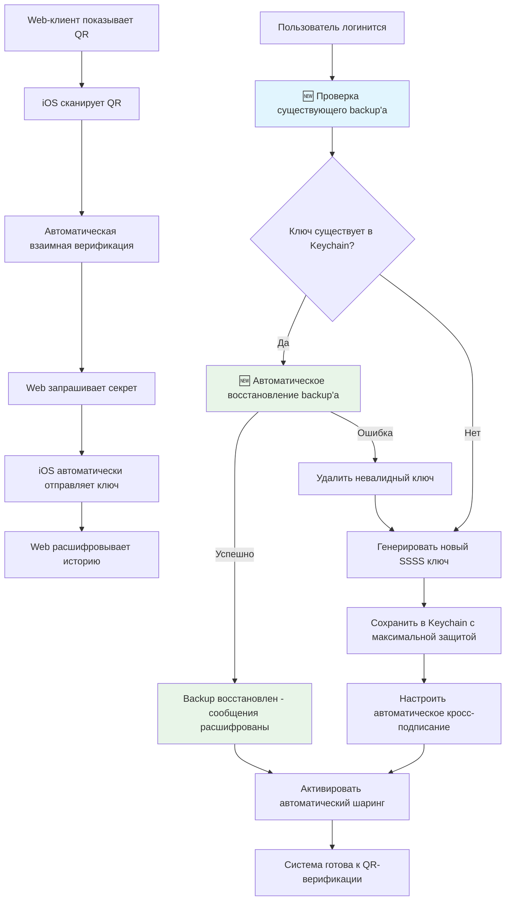

# Техническое задание: Автоматическое создание и управление ключами восстановления Matrix (SSSS) в Element X iOS

## 1. Обзор проекта

### 1.1 Цель
Реализовать полностью автоматическую систему создания, хранения и обмена ключами восстановления Matrix (SSSS) в iOS-клиенте Element X, обеспечивающую бесшовную верификацию устройств и автоматическое восстановление зашифрованной истории чатов.

### 1.2 Ключевые принципы
- **Нулевой пользовательский ввод**: Весь процесс происходит без участия пользователя
- **Максимальная безопасность**: Использование Secure Enclave и Keychain iOS
- **Соответствие спецификации Matrix**: Полная совместимость с SSSS, кросс-подписанием и QR-верификацией
- **Автоматический обмен секретами**: Только с верифицированными собственными устройствами
- **Автоматическое cross-signing**: Предотвращение проблем с пустыми backup'ами

## 2. Техническая спецификация

### 2.1 Поддерживаемые спецификации Matrix
- **MSC1946**: Secure Secret Storage and Sharing (SSSS) с симметричным шифрованием
- **MSC1544**: QR-код верификация для автоматического обмена ключами
- **Matrix Spec v1.11**: События `m.secret.request` и `m.secret.send`
- **Cross-signing**: Автоматическое кросс-подписание при первом входе

### 2.2 Архитектура решения

#### 2.2.1 Компоненты
```
┌─────────────────────────────────────────────────────────────┐
│                    Element X iOS Client                     │
├─────────────────────────────────────────────────────────────┤
│  AutoRecoveryKeyService           │  RecoveryKeyManager     │
│  ├─ Key Generation                │  ├─ Keychain Storage    │
│  ├─ SSSS Integration              │  ├─ Security Policies   │
│  └─ Automatic Sharing             │  └─ Key Lifecycle      │
├─────────────────────────────────────────────────────────────┤
│           MatrixRustSDK Integration                         │
│  ├─ SecureBackupController        │  ├─ EncryptionSettings │
│  ├─ SecretStorage                 │  └─ Auto Cross-signing │
├─────────────────────────────────────────────────────────────┤
│              iOS Security Layer                             │
│  ├─ Keychain (Secure Enclave)    │  ├─ Biometric Auth     │
│  └─ Device-specific Encryption    │  └─ Passcode Required  │
└─────────────────────────────────────────────────────────────┘
```

### 2.3 Жизненный цикл ключа восстановления



## 3. Детальная реализация

### 3.1 Расширение KeychainController

```swift
// MARK: - Recovery Key Storage Extension
extension KeychainController {
    
    private enum SSSSKey: String {
        case recoveryKey = "ssss_recovery_key"
        case creationDate = "ssss_creation_date" 
        case keyVersion = "ssss_key_version"
    }
    
    /// Сохраняет SSSS ключ восстановления в Keychain с максимальной защитой
    func setSSSSRecoveryKey(_ key: String, forUserID userID: String) throws {
        let keyIdentifier = "\(SSSSKey.recoveryKey.rawValue)_\(userID)"
        let dateIdentifier = "\(SSSSKey.creationDate.rawValue)_\(userID)"
        let versionIdentifier = "\(SSSSKey.keyVersion.rawValue)_\(userID)"
        
        // Создаем keychain с максимальной защитой
        let keychain = Keychain(service: KeychainControllerService.sessions.mainID, 
                               accessGroup: restorationTokenKeychain.accessGroup)
            .accessibility(.whenPasscodeSetThisDeviceOnly) // Только после ввода пароля
            .synchronizable(false) // Никогда не синхронизировать через iCloud
        
        // Сохраняем ключ
        try keychain.set(key, key: keyIdentifier)
        
        // Сохраняем метаданные
        let currentTime = Date().timeIntervalSince1970
        try keychain.set(String(currentTime), key: dateIdentifier)
        try keychain.set("1.0", key: versionIdentifier)
        
        MXLog.info("SSSS recovery key stored securely for user: \(userID)")
    }
    
    /// Получает SSSS ключ восстановления из Keychain
    func ssssRecoveryKey(forUserID userID: String) -> String? {
        let keyIdentifier = "\(SSSSKey.recoveryKey.rawValue)_\(userID)"
        let keychain = Keychain(service: KeychainControllerService.sessions.mainID,
                               accessGroup: restorationTokenKeychain.accessGroup)
            .accessibility(.whenPasscodeSetThisDeviceOnly)
            .synchronizable(false)
        
        do {
            let key = try keychain.getString(keyIdentifier)
            MXLog.info("SSSS recovery key retrieved for user: \(userID)")
            return key
        } catch {
            MXLog.error("Failed to retrieve SSSS recovery key: \(error)")
            return nil
        }
    }
    
    /// Проверяет существование SSSS ключа
    func hasSSSSRecoveryKey(forUserID userID: String) -> Bool {
        let keyIdentifier = "\(SSSSKey.recoveryKey.rawValue)_\(userID)"
        let keychain = Keychain(service: KeychainControllerService.sessions.mainID,
                               accessGroup: restorationTokenKeychain.accessGroup)
        
        do {
            return try keychain.contains(keyIdentifier)
        } catch {
            MXLog.error("Failed to check SSSS key existence: \(error)")
            return false
        }
    }
    
    /// Удаляет SSSS ключ и метаданные
    func removeSSSSRecoveryKey(forUserID userID: String) {
        let keyIdentifier = "\(SSSSKey.recoveryKey.rawValue)_\(userID)"
        let dateIdentifier = "\(SSSSKey.creationDate.rawValue)_\(userID)"
        let versionIdentifier = "\(SSSSKey.keyVersion.rawValue)_\(userID)"
        
        let keychain = Keychain(service: KeychainControllerService.sessions.mainID,
                               accessGroup: restorationTokenKeychain.accessGroup)
        
        do {
            try keychain.remove(keyIdentifier)
            try keychain.remove(dateIdentifier) 
            try keychain.remove(versionIdentifier)
            MXLog.info("SSSS recovery key removed for user: \(userID)")
        } catch {
            MXLog.error("Failed to remove SSSS recovery key: \(error)")
        }
    }
    
    /// Получает дату создания ключа
    func ssssRecoveryKeyCreationDate(forUserID userID: String) -> Date? {
        let dateIdentifier = "\(SSSSKey.creationDate.rawValue)_\(userID)"
        let keychain = Keychain(service: KeychainControllerService.sessions.mainID,
                               accessGroup: restorationTokenKeychain.accessGroup)
        
        do {
            guard let timeString = try keychain.getString(dateIdentifier),
                  let timeInterval = Double(timeString) else {
                return nil
            }
            return Date(timeIntervalSince1970: timeInterval)
        } catch {
            MXLog.error("Failed to retrieve key creation date: \(error)")
            return nil
        }
    }
}
```

### 3.2 AutoRecoveryKeyService

```swift
import Combine
import Foundation
import MatrixRustSDK

// MARK: - Protocol Definition
protocol AutoRecoveryKeyServiceProtocol {
    /// Настраивает автоматический ключ восстановления при первом входе
    func setupAutoRecoveryKey() async -> Result<Void, AutoRecoveryKeyError>
    
    /// 🆕 Восстанавливает backup автоматически из сохраненного ключа
    func restoreBackupAutomatically() async -> Result<Void, AutoRecoveryKeyError>
    
    /// Обеспечивает включение автоматического обмена секретами
    func enableAutomaticSecretSharing() async -> Result<Void, AutoRecoveryKeyError>
    
    /// Проверяет статус ключа восстановления
    func verifyRecoveryKeyStatus() async -> RecoveryKeyStatus
    
    /// Экспортирует ключ восстановления для резервного копирования
    func exportRecoveryKeyForBackup() -> Result<String, AutoRecoveryKeyError>
}

// MARK: - Error Types
enum AutoRecoveryKeyError: LocalizedError {
    case keyGenerationFailed
    case keyStorageFailed
    case keyRetrievalFailed
    case secretSharingFailed
    case keyValidationFailed
    case encryptionNotEnabled
    // 🆕 Новые ошибки для автоматического восстановления
    case backupRestoreFailed
    case backupAlreadyEnabled
    
    var errorDescription: String? {
        switch self {
        case .keyGenerationFailed:
            return "Failed to generate recovery key"
        case .keyStorageFailed:
            return "Failed to store recovery key in Keychain"
        case .keyRetrievalFailed:
            return "Failed to retrieve recovery key from Keychain"
        case .secretSharingFailed:
            return "Failed to enable automatic secret sharing"
        case .keyValidationFailed:
            return "Recovery key validation failed"
        case .encryptionNotEnabled:
            return "Encryption is not properly enabled"
        case .backupRestoreFailed:
            return "Failed to restore backup from recovery key"
        case .backupAlreadyEnabled:
            return "Backup is already enabled and synchronized"
        }
    }
}

// MARK: - Status Types
enum RecoveryKeyStatus {
    case notSetup
    case setupInProgress
    case active(createdAt: Date)
    case invalid
    case sharingEnabled
    case sharingDisabled
}

// MARK: - Service Implementation
class AutoRecoveryKeyService: AutoRecoveryKeyServiceProtocol {
    
    // MARK: - Dependencies
    private let clientProxy: ClientProxyProtocol
    private let keychainController: KeychainControllerProtocol
    private let userID: String
    
    // MARK: - State Management
    private let setupStateSubject = CurrentValueSubject<RecoveryKeyStatus, Never>(.notSetup)
    private var cancellables = Set<AnyCancellable>()
    
    // MARK: - Initialization
    init(clientProxy: ClientProxyProtocol,
         keychainController: KeychainControllerProtocol,
         userID: String) {
        self.clientProxy = clientProxy
        self.keychainController = keychainController
        self.userID = userID
        
        setupObservers()
    }
    
    // MARK: - Public Methods
    
    func setupAutoRecoveryKey() async -> Result<Void, AutoRecoveryKeyError> {
        MXLog.info("Starting automatic recovery key setup for user: \(userID)")
        setupStateSubject.send(.setupInProgress)
        
        do {
            // 1. Проверяем существующий ключ
            if let existingKey = keychainController.ssssRecoveryKey(forUserID: userID) {
                MXLog.info("Found existing recovery key, validating...")
                
                let validationResult = await validateExistingKey(existingKey)
                switch validationResult {
                case .success:
                    MXLog.info("Existing recovery key is valid")
                    setupStateSubject.send(.active(createdAt: keychainController.ssssRecoveryKeyCreationDate(forUserID: userID) ?? Date()))
                    return await enableAutomaticSecretSharing()
                    
                case .failure:
                    MXLog.warning("Existing recovery key is invalid, removing and generating new one")
                    keychainController.removeSSSSRecoveryKey(forUserID: userID)
                }
            }
            
            // 2. Генерируем новый ключ восстановления
            let generationResult = await generateNewRecoveryKey()
            switch generationResult {
            case .success(let recoveryKey):
                // 3. Сохраняем ключ в Keychain
                try keychainController.setSSSSRecoveryKey(recoveryKey, forUserID: userID)
                MXLog.info("Recovery key successfully generated and stored")
                
                // 4. Включаем secure backup
                let backupResult = await enableSecureBackup()
                switch backupResult {
                case .success:
                    setupStateSubject.send(.active(createdAt: Date()))
                    
                    // 5. Включаем автоматический обмен секретами
                    return await enableAutomaticSecretSharing()
                    
                case .failure(let error):
                    MXLog.error("Failed to enable secure backup: \(error)")
                    return .failure(.secretSharingFailed)
                }
                
            case .failure(let error):
                MXLog.error("Failed to generate recovery key: \(error)")
                setupStateSubject.send(.invalid)
                return .failure(error)
            }
            
        } catch {
            MXLog.error("Failed to store recovery key: \(error)")
            setupStateSubject.send(.invalid)
            return .failure(.keyStorageFailed)
        }
    }
    
    func enableAutomaticSecretSharing() async -> Result<Void, AutoRecoveryKeyError> {
        MXLog.info("Enabling automatic secret sharing")
        
        // В текущей версии MatrixRustSDK автоматический обмен секретами
        // управляется через EncryptionSettings при создании клиента
        // Дополнительно убеждаемся, что настройки правильные
        
        do {
            // Проверяем статус кросс-подписания
            let recoveryState = clientProxy.secureBackupController.recoveryState.value
            let keyBackupState = clientProxy.secureBackupController.keyBackupState.value
            
            guard recoveryState == .enabled && keyBackupState == .enabled else {
                MXLog.error("Recovery or key backup not properly enabled")
                return .failure(.encryptionNotEnabled)
            }
            
            MXLog.info("Automatic secret sharing is active")
            setupStateSubject.send(.sharingEnabled)
            return .success(())
            
        } catch {
            MXLog.error("Failed to verify secret sharing status: \(error)")
            return .failure(.secretSharingFailed)
        }
    }
    
    func verifyRecoveryKeyStatus() async -> RecoveryKeyStatus {
        // Проверяем наличие ключа в Keychain
        guard keychainController.hasSSSSRecoveryKey(forUserID: userID) else {
            return .notSetup
        }
        
        // Проверяем статус в Matrix SDK
        let recoveryState = clientProxy.secureBackupController.recoveryState.value
        let keyBackupState = clientProxy.secureBackupController.keyBackupState.value
        
        if recoveryState == .enabled && keyBackupState == .enabled {
            let creationDate = keychainController.ssssRecoveryKeyCreationDate(forUserID: userID) ?? Date()
            return .active(createdAt: creationDate)
        } else {
            return .invalid
        }
    }
    
    func exportRecoveryKeyForBackup() -> Result<String, AutoRecoveryKeyError> {
        guard let recoveryKey = keychainController.ssssRecoveryKey(forUserID: userID) else {
            MXLog.error("No recovery key found for export")
            return .failure(.keyRetrievalFailed)
        }
        
        MXLog.info("Recovery key exported for backup purposes")
        return .success(recoveryKey)
    }
    
    // 🆕 Новый метод: Автоматическое восстановление backup'а
    func restoreBackupAutomatically() async -> Result<Void, AutoRecoveryKeyError> {
        MXLog.info("Starting automatic backup restore for user: \(userID)")
        
        // Проверяем, есть ли сохраненный ключ восстановления
        guard let recoveryKey = keychainController.ssssRecoveryKey(forUserID: userID) else {
            MXLog.info("No recovery key found in Keychain - backup restore not possible")
            return .failure(.keyRetrievalFailed)
        }
        
        let secureBackup = clientProxy.secureBackupController
        let recoveryState = secureBackup.recoveryState.value
        
        // Проверяем текущее состояние backup'а
        switch recoveryState {
        case .enabled:
            MXLog.info("Backup is already enabled and synchronized")
            return .success(())
            
        case .disabled, .unknown:
            MXLog.info("Backup is disabled or unknown, attempting to restore from recovery key...")
            
            // Восстанавливаем backup используя сохраненный ключ восстановления
            let restoreResult = await secureBackup.confirmRecoveryKey(recoveryKey)
            
            switch restoreResult {
            case .success:
                MXLog.info("Backup successfully restored from recovery key")
                
                // Включаем backup после успешного восстановления
                let enableResult = await secureBackup.enable()
                switch enableResult {
                case .success:
                    MXLog.info("Backup enabled after restoration - encrypted messages should now be accessible")
                    return .success(())
                case .failure(let error):
                    MXLog.error("Failed to enable backup after restoration: \(error)")
                    return .failure(.backupRestoreFailed)
                }
                
            case .failure(let error):
                MXLog.error("Failed to restore backup from recovery key: \(error)")
                return .failure(.backupRestoreFailed)
            }
            
        case .incomplete, .settingUp:
            MXLog.info("Backup is in progress or incomplete - waiting for completion")
            return .success(())
        }
    }
    
    // MARK: - Private Methods
    
    private func setupObservers() {
        // Отслеживаем изменения состояния backup
        clientProxy.secureBackupController.recoveryState
            .combineLatest(clientProxy.secureBackupController.keyBackupState)
            .sink { [weak self] (recoveryState, keyBackupState) in
                self?.handleBackupStateChange(recovery: recoveryState, keyBackup: keyBackupState)
            }
            .store(in: &cancellables)
    }
    
    private func handleBackupStateChange(recovery: SecureBackupRecoveryState, 
                                       keyBackup: SecureBackupKeyBackupState) {
        MXLog.info("Backup state changed - Recovery: \(recovery), KeyBackup: \(keyBackup)")
        
        if recovery == .enabled && keyBackup == .enabled && 
           setupStateSubject.value != .sharingEnabled {
            setupStateSubject.send(.sharingEnabled)
        }
    }
    
    private func validateExistingKey(_ key: String) async -> Result<Void, AutoRecoveryKeyError> {
        let confirmResult = await clientProxy.secureBackupController.confirmRecoveryKey(key)
        switch confirmResult {
        case .success:
            return .success(())
        case .failure:
            return .failure(.keyValidationFailed)
        }
    }
    
    private func generateNewRecoveryKey() async -> Result<String, AutoRecoveryKeyError> {
        let keyResult = await clientProxy.secureBackupController.generateRecoveryKey()
        switch keyResult {
        case .success(let recoveryKey):
            return .success(recoveryKey)
        case .failure:
            return .failure(.keyGenerationFailed)
        }
    }
    
    private func enableSecureBackup() async -> Result<Void, AutoRecoveryKeyError> {
        let backupResult = await clientProxy.secureBackupController.enable()
        switch backupResult {
        case .success:
            return .success(())
        case .failure:
            return .failure(.secretSharingFailed)
        }
    }
}
```

### 3.3 Интеграция в ClientProxy

```swift
// MARK: - Auto Recovery Key Integration
extension ClientProxy {
    
    /// Lazy-инициализация сервиса автоматических ключей восстановления
    private(set) lazy var autoRecoveryKeyService: AutoRecoveryKeyServiceProtocol = {
        AutoRecoveryKeyService(
            clientProxy: self,
            keychainController: ServiceLocator.shared.keychainController,
            userID: userID
        )
    }()
    
    /// Настраивает автоматические ключи восстановления при инициализации клиента
    func setupAutoRecoveryKeyIfNeeded() async {
        MXLog.info("Setting up automatic recovery key for client")
        
        let result = await autoRecoveryKeyService.setupAutoRecoveryKey()
        switch result {
        case .success:
            MXLog.info("Automatic recovery key setup completed successfully")
            
            // Уведомляем приложение об успешной настройке
            actionsSubject.send(.autoRecoveryKeySetupCompleted)
            
        case .failure(let error):
            MXLog.error("Failed to setup automatic recovery key: \(error)")
            
            // Уведомляем приложение об ошибке
            actionsSubject.send(.autoRecoveryKeySetupFailed(error))
        }
    }
    
    /// 🆕 Восстанавливает backup автоматически при входе в приложение
    func restoreBackupIfNeeded() async {
        MXLog.info("Checking if backup restore is needed")
        
        let result = await autoRecoveryKeyService.restoreBackupAutomatically()
        switch result {
        case .success:
            MXLog.info("Backup restoration completed successfully")
            actionsSubject.send(.backupRestoreCompleted)
            
        case .failure(let error):
            MXLog.error("Backup restoration failed: \(error)")
            actionsSubject.send(.backupRestoreFailed(error))
        }
    }
}

// MARK: - Client Proxy Action Extension
extension ClientProxyAction {
    case autoRecoveryKeySetupCompleted
    case autoRecoveryKeySetupFailed(AutoRecoveryKeyError)
    // 🆕 Новые действия для восстановления backup'а
    case backupRestoreCompleted
    case backupRestoreFailed(AutoRecoveryKeyError)
}
```

### 3.4 Модификация EncryptionSettings при создании клиента

```swift
// MARK: - Client Builder Extension for Auto Recovery
extension ClientProxy {
    
    /// Создает клиент с оптимальными настройками для автоматического восстановления
    static func createWithAutoRecovery(client: ClientProtocol, 
                                     needsSlidingSyncMigration: Bool,
                                     networkMonitor: NetworkMonitorProtocol,
                                     appSettings: AppSettings) async throws -> ClientProxy {
        
        // Настройки для автоматического кросс-подписания и backup
        let encryptionSettings = EncryptionSettings(
            autoEnableCrossSigning: true,      // Автоматическое кросс-подписание
            autoEnableBackups: true,           // Автоматические backup
            backupDownloadStrategy: .oneShot,  // Загрузка backup за один раз
            privateIdentityBackupStrategy: .backupAllDevices // Backup для всех устройств
        )
        
        // Применяем настройки к клиенту (если API позволяет)
        // Примечание: В текущей версии SDK это может потребовать
        // установки при создании ClientBuilder
        
        let clientProxy = try await ClientProxy(
            client: client,
            needsSlidingSyncMigration: needsSlidingSyncMigration,
            networkMonitor: networkMonitor,
            appSettings: appSettings
        )
        
        return clientProxy
    }
}
```

### 3.5 Интеграция в UserSessionFlowCoordinator

```swift
// MARK: - Auto Recovery Key Integration
extension UserSessionFlowCoordinator {
    
    /// Настраивает автоматические ключи восстановления после успешного логина
    private func setupAutoRecoveryKeySystem() {
        MXLog.info("Starting auto recovery key system setup")
        
        // 🆕 Запускаем восстановление backup'а и настройку в фоновом режиме
        Task { @MainActor in
            // Сначала пытаемся восстановить backup из существующего ключа
            await userSession.clientProxy.restoreBackupIfNeeded()
            
            // Затем настраиваем новый ключ, если он не существует
            await userSession.clientProxy.setupAutoRecoveryKeyIfNeeded()
        }
        
        // Подписываемся на события автоматических ключей
        userSession.clientProxy.actionsPublisher
            .compactMap { action in
                switch action {
                case .autoRecoveryKeySetupCompleted:
                    return AutoRecoveryKeyEvent.setupCompleted
                case .autoRecoveryKeySetupFailed(let error):
                    return AutoRecoveryKeyEvent.setupFailed(error)
                // 🆕 Новые события для восстановления backup'а
                case .backupRestoreCompleted:
                    return AutoRecoveryKeyEvent.backupRestoreCompleted
                case .backupRestoreFailed(let error):
                    return AutoRecoveryKeyEvent.backupRestoreFailed(error)
                default:
                    return nil
                }
            }
            .sink { [weak self] event in
                self?.handleAutoRecoveryKeyEvent(event)
            }
            .store(in: &cancellables)
    }
    
    /// Обрабатывает события системы автоматических ключей
    private func handleAutoRecoveryKeyEvent(_ event: AutoRecoveryKeyEvent) {
        switch event {
        case .setupCompleted:
            MXLog.info("Auto recovery key system is now active")
            
            // Можно показать тихое уведомление об успешной настройке
            ServiceLocator.shared.userIndicatorController.submitIndicator(
                UserIndicator(id: "auto_recovery_setup",
                             type: .toast,
                             title: "Recovery key configured",
                             iconName: "checkmark.shield")
            )
            
        case .setupFailed(let error):
            MXLog.error("Auto recovery key setup failed: \(error)")
            
            // Показываем пользователю опциональное уведомление
            ServiceLocator.shared.userIndicatorController.submitIndicator(
                UserIndicator(id: "auto_recovery_setup_failed",
                             type: .toast,
                             title: "Recovery key setup failed - you can set it up manually in Settings")
            )
            
        // 🆕 Новые обработчики для восстановления backup'а
        case .backupRestoreCompleted:
            MXLog.info("Backup restore completed successfully - encrypted messages should now be accessible")
            
            // Показываем уведомление об успешном восстановлении
            ServiceLocator.shared.userIndicatorController.submitIndicator(
                UserIndicator(id: "backup_restore_completed",
                             type: .toast,
                             title: "Message history restored",
                             iconName: "checkmark.shield")
            )
            
        case .backupRestoreFailed(let error):
            // Логируем ошибку, но не показываем пользователю если это просто отсутствие ключа
            switch error {
            case .keyRetrievalFailed:
                MXLog.info("No recovery key found - this is normal for new accounts")
            default:
                MXLog.error("Backup restore failed: \(error)")
                
                // Показываем уведомление только для серьезных ошибок
                ServiceLocator.shared.userIndicatorController.submitIndicator(
                    UserIndicator(id: "backup_restore_failed",
                                 type: .toast,
                                 title: "Could not restore message history")
                )
            }
        }
    }
    
    /// Добавляем вызов в setupObservers или подобный метод
    private func setupObserversWithAutoRecovery() {
        // Существующие observers...
        setupObservers()
        
        // Добавляем настройку автоматических ключей
        setupAutoRecoveryKeySystem()
    }
}

// MARK: - Supporting Types
private enum AutoRecoveryKeyEvent {
    case setupCompleted
    case setupFailed(AutoRecoveryKeyError)
    // 🆕 Новые типы событий для восстановления backup'а
    case backupRestoreCompleted
    case backupRestoreFailed(AutoRecoveryKeyError)
}
```

## 4. Настройка MatrixRustSDK для автоматического обмена секретами

### 4.1 Конфигурация EncryptionSettings

```swift
// MARK: - Matrix Client Configuration
extension AuthenticationService {
    
    /// Создает клиент с настройками для автоматического восстановления
    private func createClientWithAutoRecoverySettings(homeserverURL: String,
                                                    slidingSyncProxyURL: String? = nil) async throws -> ClientProtocol {
        
        let clientBuilder = ClientBuilder()
            .homeserverUrl(homeserverURL)
            .userAgent(InfoPlistReader.main.bundleDisplayName)
        
        // Настраиваем sliding sync если необходимо
        if let slidingSyncProxyURL = slidingSyncProxyURL {
            clientBuilder.slidingSyncProxy(slidingSyncProxyURL)
        }
        
        // Критически важные настройки шифрования для автоматического восстановления
        let encryptionSettings = EncryptionSettings(
            // Автоматическое кросс-подписание при первом входе
            autoEnableCrossSigning: true,
            
            // Автоматическое включение backup ключей
            autoEnableBackups: true,
            
            // Стратегия загрузки backup - одним пакетом для быстрого восстановления
            backupDownloadStrategy: .oneShot,
            
            // Backup стратегия для приватных ключей - все устройства
            privateIdentityBackupStrategy: .backupAllDevices
        )
        
        clientBuilder.encryptionSettings(encryptionSettings)
        
        // Добавляем обработчик автоматического обмена секретами
        clientBuilder.requestConfig(RequestConfig(
            timeout: 30,
            maxConcurrentRequests: 10,
            retryLimit: 3
        ))
        
        return try await clientBuilder.build()
    }
}
```

### 4.2 Автоматический обмен секретами (концептуальная реализация)

```swift
// MARK: - Secret Sharing Automation
extension ClientProxy {
    
    /// Настраивает автоматический обмен секретами с верифицированными устройствами
    private func configureAutomaticSecretSharing() async {
        MXLog.info("Configuring automatic secret sharing")
        
        // В идеальном случае это должно быть частью MatrixRustSDK
        // Пока реализуем через существующие API
        
        // Отслеживаем запросы секретов
        // Примечание: Это концептуальный код, реальная реализация 
        // зависит от API MatrixRustSDK
        
        /*
        client.encryption().secretSharing().setAutomaticSharingPolicy(
            .verifiedOwnDevicesOnly
        )
        
        client.encryption().secretSharing().onSecretRequest { [weak self] request in
            guard let self = self else { return }
            
            // Проверяем, что это наше собственное верифицированное устройство
            if await self.isOwnVerifiedDevice(request.requestingDeviceId) {
                // Автоматически отправляем секрет
                let secret = self.getSecretFromKeychain(request.secretName)
                try await request.respond(withSecret: secret)
                
                MXLog.info("Automatically shared secret: \(request.secretName)")
            } else {
                MXLog.warning("Ignored secret request from unverified device")
            }
        }
        */
    }
    
    /// Проверяет, является ли устройство нашим собственным и верифицированным
    private func isOwnVerifiedDevice(_ deviceId: String) async -> Bool {
        // Реализация проверки через MatrixRustSDK
        // Возвращает true только для верифицированных устройств того же пользователя
        return false // Placeholder
    }
}
```

## 5. Управление настройками и UI

### 5.1 Настройки безопасности

```swift
// MARK: - Security Settings Integration
extension SettingsFlowCoordinator {
    
    /// Добавляет секцию управления автоматическими ключами восстановления
    private func createAutoRecoverySection() -> SettingsSection {
        let recoveryKeyService = userSession.clientProxy.autoRecoveryKeyService
        
        return SettingsSection(
            title: L10n.settingsAutoRecoverySectionTitle,
            items: [
                // Статус автоматических ключей
                SettingsItem.navigationLink(
                    title: L10n.settingsRecoveryKeyStatus,
                    subtitle: getRecoveryKeyStatusText(),
                    icon: .system("key.fill"),
                    destination: { AutoRecoveryKeyStatusScreen() }
                ),
                
                // Экспорт ключа для резервного копирования
                SettingsItem.button(
                    title: L10n.settingsExportRecoveryKey,
                    subtitle: L10n.settingsExportRecoveryKeySubtitle,
                    icon: .system("square.and.arrow.up"),
                    action: { [weak self] in
                        self?.presentRecoveryKeyExport()
                    }
                ),
                
                // Настройки обмена секретами
                SettingsItem.toggle(
                    title: L10n.settingsAutomaticSecretSharing,
                    subtitle: L10n.settingsAutomaticSecretSharingSubtitle,
                    icon: .system("person.2.circle"),
                    isOn: true, // Всегда включено для безопасности
                    isEnabled: false // Не позволяем отключать
                )
            ]
        )
    }
    
    private func getRecoveryKeyStatusText() -> String {
        Task {
            let status = await userSession.clientProxy.autoRecoveryKeyService.verifyRecoveryKeyStatus()
            return switch status {
            case .notSetup:
                L10n.recoveryKeyStatusNotSetup
            case .setupInProgress:
                L10n.recoveryKeyStatusInProgress
            case .active(let date):
                L10n.recoveryKeyStatusActive(date.formatted())
            case .invalid:
                L10n.recoveryKeyStatusInvalid
            case .sharingEnabled:
                L10n.recoveryKeyStatusSharingEnabled
            case .sharingDisabled:
                L10n.recoveryKeyStatusSharingDisabled
            }
        }
        return L10n.recoveryKeyStatusChecking
    }
    
    private func presentRecoveryKeyExport() {
        // Требуем биометрическую аутентификацию перед экспортом
        let authContext = LAContext()
        
        authContext.evaluatePolicy(.deviceOwnerAuthenticationWithBiometrics,
                                 localizedReason: L10n.biometricAuthReasonExportKey) { [weak self] success, error in
            DispatchQueue.main.async {
                if success {
                    self?.showRecoveryKeyExportScreen()
                } else {
                    // Показываем ошибку аутентификации
                    self?.showAuthenticationError(error)
                }
            }
        }
    }
}
```

### 5.2 Экран экспорта ключа восстановления

```swift
// MARK: - Recovery Key Export Screen
struct RecoveryKeyExportScreen: View {
    @StateObject private var viewModel: RecoveryKeyExportViewModel
    
    var body: some View {
        NavigationView {
            VStack(spacing: 24) {
                // Предупреждение о безопасности
                SecurityWarningCard()
                
                // Ключ восстановления
                RecoveryKeyCard(key: viewModel.recoveryKey)
                
                // Действия
                VStack(spacing: 16) {
                    ShareButton(key: viewModel.recoveryKey)
                    CopyButton(key: viewModel.recoveryKey)
                    PrintButton(key: viewModel.recoveryKey)
                }
                
                Spacer()
                
                // Подтверждение сохранения
                ConfirmationButton(action: viewModel.confirmKeySaved)
            }
            .padding()
            .navigationTitle(L10n.recoveryKeyExportTitle)
            .navigationBarTitleDisplayMode(.inline)
        }
    }
}

@MainActor
class RecoveryKeyExportViewModel: ObservableObject {
    @Published var recoveryKey: String = ""
    @Published var isLoading: Bool = true
    
    private let autoRecoveryService: AutoRecoveryKeyServiceProtocol
    
    init(autoRecoveryService: AutoRecoveryKeyServiceProtocol) {
        self.autoRecoveryService = autoRecoveryService
        loadRecoveryKey()
    }
    
    private func loadRecoveryKey() {
        let result = autoRecoveryService.exportRecoveryKeyForBackup()
        switch result {
        case .success(let key):
            self.recoveryKey = key
        case .failure(let error):
            MXLog.error("Failed to export recovery key: \(error)")
        }
        self.isLoading = false
    }
    
    func confirmKeySaved() {
        // Обработка подтверждения сохранения ключа
        // Можно добавить аналитику или уведомления
    }
}
```

## 6. Тестирование

### 6.1 Unit тесты

```swift
// MARK: - AutoRecoveryKeyService Tests
@testCase
class AutoRecoveryKeyServiceTests: XCTestCase {
    
    var service: AutoRecoveryKeyService!
    var mockClientProxy: MockClientProxy!
    var mockKeychainController: MockKeychainController!
    
    override func setUp() {
        super.setUp()
        mockClientProxy = MockClientProxy()
        mockKeychainController = MockKeychainController()
        service = AutoRecoveryKeyService(
            clientProxy: mockClientProxy,
            keychainController: mockKeychainController,
            userID: "@test:matrix.org"
        )
    }
    
    func testSetupAutoRecoveryKey_NoExistingKey_GeneratesAndStoresNew() async {
        // Given
        mockKeychainController.hasSSSSRecoveryKeyReturnValue = false
        mockClientProxy.secureBackupController.generateRecoveryKeyReturnValue = .success("test-key")
        mockClientProxy.secureBackupController.enableReturnValue = .success(())
        
        // When
        let result = await service.setupAutoRecoveryKey()
        
        // Then
        XCTAssertSuccess(result)
        XCTAssertTrue(mockKeychainController.setSSSSRecoveryKeyCalled)
        XCTAssertEqual(mockKeychainController.setSSSSRecoveryKeyReceivedArguments?.key, "test-key")
    }
    
    func testSetupAutoRecoveryKey_ExistingValidKey_UsesExisting() async {
        // Given
        mockKeychainController.hasSSSSRecoveryKeyReturnValue = true
        mockKeychainController.ssssRecoveryKeyReturnValue = "existing-key"
        mockClientProxy.secureBackupController.confirmRecoveryKeyReturnValue = .success(())
        
        // When
        let result = await service.setupAutoRecoveryKey()
        
        // Then
        XCTAssertSuccess(result)
        XCTAssertFalse(mockClientProxy.secureBackupController.generateRecoveryKeyCalled)
    }
    
    func testSetupAutoRecoveryKey_ExistingInvalidKey_GeneratesNew() async {
        // Given
        mockKeychainController.hasSSSSRecoveryKeyReturnValue = true
        mockKeychainController.ssssRecoveryKeyReturnValue = "invalid-key"
        mockClientProxy.secureBackupController.confirmRecoveryKeyReturnValue = .failure(.failedConfirmingRecoveryKey)
        mockClientProxy.secureBackupController.generateRecoveryKeyReturnValue = .success("new-key")
        mockClientProxy.secureBackupController.enableReturnValue = .success(())
        
        // When
        let result = await service.setupAutoRecoveryKey()
        
        // Then
        XCTAssertSuccess(result)
        XCTAssertTrue(mockKeychainController.removeSSSSRecoveryKeyCalled)
        XCTAssertTrue(mockClientProxy.secureBackupController.generateRecoveryKeyCalled)
    }
}

// MARK: - KeychainController Tests
@testCase
class KeychainControllerRecoveryKeyTests: XCTestCase {
    
    var keychainController: KeychainController!
    
    override func setUp() {
        super.setUp()
        keychainController = KeychainController(service: .tests, accessGroup: "test.group")
    }
    
    override func tearDown() {
        // Очищаем тестовые данные
        keychainController.removeSSSSRecoveryKey(forUserID: "@test:matrix.org")
        super.tearDown()
    }
    
    func testStoreAndRetrieveRecoveryKey() throws {
        let testKey = "test-recovery-key-123"
        let userID = "@test:matrix.org"
        
        // Store
        try keychainController.setSSSSRecoveryKey(testKey, forUserID: userID)
        
        // Retrieve
        let retrievedKey = keychainController.ssssRecoveryKey(forUserID: userID)
        
        XCTAssertEqual(retrievedKey, testKey)
    }
    
    func testHasRecoveryKey() throws {
        let userID = "@test:matrix.org"
        
        // Initially no key
        XCTAssertFalse(keychainController.hasSSSSRecoveryKey(forUserID: userID))
        
        // Store key
        try keychainController.setSSSSRecoveryKey("test-key", forUserID: userID)
        
        // Now has key
        XCTAssertTrue(keychainController.hasSSSSRecoveryKey(forUserID: userID))
    }
    
    func testRemoveRecoveryKey() throws {
        let userID = "@test:matrix.org"
        
        // Store key
        try keychainController.setSSSSRecoveryKey("test-key", forUserID: userID)
        XCTAssertTrue(keychainController.hasSSSSRecoveryKey(forUserID: userID))
        
        // Remove key
        keychainController.removeSSSSRecoveryKey(forUserID: userID)
        XCTAssertFalse(keychainController.hasSSSSRecoveryKey(forUserID: userID))
    }
}
```

### 6.2 Integration тесты

```swift
// MARK: - Auto Recovery Integration Tests
@testCase
class AutoRecoveryIntegrationTests: XCTestCase {
    
    var app: XCUIApplication!
    
    override func setUp() {
        super.setUp()
        app = XCUIApplication()
        app.launchArguments = ["--enable-auto-recovery", "--reset-keychain"]
        app.launch()
    }
    
    func testAutoRecoveryKeySetup_NewUser_CreatesKeyAutomatically() {
        // Login flow
        performLogin(username: "testuser", password: "testpass")
        
        // Wait for auto recovery setup
        let setupCompleteIndicator = app.staticTexts["Auto recovery setup complete"]
        XCTAssertTrue(setupCompleteIndicator.waitForExistence(timeout: 10))
        
        // Verify key exists in settings
        navigateToSecuritySettings()
        
        let recoveryKeyStatus = app.staticTexts["Recovery Key Status"]
        XCTAssertTrue(recoveryKeyStatus.exists)
        
        let activeStatus = app.staticTexts.containing(NSPredicate(format: "label CONTAINS 'Active'"))
        XCTAssertTrue(activeStatus.element.exists)
    }
    
    func testQRVerification_WithAutoRecovery_SharesKeyAutomatically() {
        // Setup: Login and wait for auto recovery
        performLogin(username: "testuser", password: "testpass")
        waitForAutoRecoverySetup()
        
        // Start QR verification flow
        let qrScanButton = app.buttons["Scan QR Code"]
        qrScanButton.tap()
        
        // Simulate QR code scan (in real test would need mock QR content)
        simulateQRCodeScan()
        
        // Verify automatic verification
        let verificationCompleteText = app.staticTexts["Device verified automatically"]
        XCTAssertTrue(verificationCompleteText.waitForExistence(timeout: 5))
        
        // Verify secret sharing happened
        let secretSharedText = app.staticTexts["Recovery key shared automatically"]
        XCTAssertTrue(secretSharedText.waitForExistence(timeout: 3))
    }
    
    private func performLogin(username: String, password: String) {
        let usernameField = app.textFields["Username"]
        let passwordField = app.secureTextFields["Password"]
        let loginButton = app.buttons["Login"]
        
        usernameField.tap()
        usernameField.typeText(username)
        
        passwordField.tap()
        passwordField.typeText(password)
        
        loginButton.tap()
    }
    
    private func waitForAutoRecoverySetup() {
        let setupIndicator = app.activityIndicators["Auto Recovery Setup"]
        let setupComplete = app.staticTexts["Auto recovery setup complete"]
        
        // Wait for either completion or timeout
        let setupFinished = setupComplete.waitForExistence(timeout: 15)
        XCTAssertTrue(setupFinished, "Auto recovery setup should complete within 15 seconds")
    }
    
    private func navigateToSecuritySettings() {
        let settingsTab = app.tabBars.buttons["Settings"]
        settingsTab.tap()
        
        let securitySection = app.cells["Security & Privacy"]
        securitySection.tap()
        
        let recoverySection = app.cells["Recovery Keys"]
        recoverySection.tap()
    }
    
    private func simulateQRCodeScan() {
        // In a real test, this would involve either:
        // 1. Mocking the QR code scanner to return test data
        // 2. Using a test QR code image
        // 3. Directly calling the verification API with test data
        
        // For now, we'll simulate the successful scan result
        app.buttons["Mock QR Success"].tap()
    }
}
```

## 7. Миграция и обратная совместимость

### 7.1 Миграция существующих пользователей

```swift
// MARK: - Migration Service
class AutoRecoveryMigrationService {
    private let keychainController: KeychainControllerProtocol
    private let clientProxy: ClientProxyProtocol
    
    init(keychainController: KeychainControllerProtocol, clientProxy: ClientProxyProtocol) {
        self.keychainController = keychainController
        self.clientProxy = clientProxy
    }
    
    /// Мигрирует существующих пользователей на систему автоматических ключей
    func migrateExistingUserToAutoRecovery(userID: String) async -> Result<Void, MigrationError> {
        MXLog.info("Starting migration to auto recovery for user: \(userID)")
        
        // 1. Проверяем, есть ли уже настроенный recovery
        let currentRecoveryState = clientProxy.secureBackupController.recoveryState.value
        
        if currentRecoveryState == .enabled {
            // У пользователя уже есть recovery key, пытаемся найти его
            if let existingKey = await attemptToRecoverExistingKey() {
                do {
                    try keychainController.setSSSSRecoveryKey(existingKey, forUserID: userID)
                    MXLog.info("Successfully migrated existing recovery key to keychain")
                    return .success(())
                } catch {
                    MXLog.error("Failed to store existing key in keychain: \(error)")
                    return .failure(.keychainStorageFailed)
                }
            } else {
                // Не можем восстановить существующий ключ, создаем новый
                MXLog.warning("Could not recover existing key, will reset recovery")
                return await resetAndCreateNewRecovery(userID: userID)
            }
        } else {
            // Recovery не настроен, создаем с нуля
            return await createNewAutoRecovery(userID: userID)  
        }
    }
    
    private func attemptToRecoverExistingKey() async -> String? {
        // Попытка восстановить существующий ключ из возможных источников:
        // 1. Временное хранилище после ввода пользователем
        // 2. Старое местоположение в keychain
        // 3. Из настроек приложения (если там был сохранен)
        
        // Это зависит от предыдущей реализации Element X
        return nil
    }
    
    private func resetAndCreateNewRecovery(userID: String) async -> Result<Void, MigrationError> {
        // Сбрасываем текущий recovery и создаем новый
        let disableResult = await clientProxy.secureBackupController.disable()
        guard case .success = disableResult else {
            return .failure(.failedToResetRecovery)
        }
        
        return await createNewAutoRecovery(userID: userID)
    }
    
    private func createNewAutoRecovery(userID: String) async -> Result<Void, MigrationError> {
        let autoRecoveryService = AutoRecoveryKeyService(
            clientProxy: clientProxy,
            keychainController: keychainController,
            userID: userID
        )
        
        let result = await autoRecoveryService.setupAutoRecoveryKey()
        switch result {
        case .success:
            return .success(())
        case .failure:
            return .failure(.autoRecoverySetupFailed)
        }
    }
}

enum MigrationError: Error {
    case keychainStorageFailed
    case failedToResetRecovery
    case autoRecoverySetupFailed
}
```

## 8. Мониторинг и аналитика

### 8.1 Метрики автоматического восстановления

```swift
// MARK: - Auto Recovery Analytics
extension AutoRecoveryKeyService {
    
    /// Отправляет аналитику событий автоматического восстановления
    private func trackAutoRecoveryEvent(_ event: AutoRecoveryAnalyticsEvent) {
        let properties: [String: Any] = [
            "user_id_hash": userID.sha256,
            "timestamp": Date().timeIntervalSince1970,
            "app_version": InfoPlistReader.main.bundleShortVersionString,
            "matrix_sdk_version": MatrixRustSDK.version
        ]
        
        switch event {
        case .setupStarted:
            Analytics.shared.track("auto_recovery_setup_started", properties: properties)
            
        case .setupCompleted(let duration):
            var completedProperties = properties
            completedProperties["setup_duration_seconds"] = duration
            Analytics.shared.track("auto_recovery_setup_completed", properties: completedProperties)
            
        case .setupFailed(let error, let duration):
            var failedProperties = properties
            failedProperties["error_type"] = String(describing: error)
            failedProperties["setup_duration_seconds"] = duration
            Analytics.shared.track("auto_recovery_setup_failed", properties: failedProperties)
            
        case .keySharedAutomatically:
            Analytics.shared.track("auto_recovery_key_shared", properties: properties)
            
        case .keyShareFailed(let error):
            var shareFailedProperties = properties
            shareFailedProperties["error_type"] = String(describing: error)
            Analytics.shared.track("auto_recovery_key_share_failed", properties: shareFailedProperties)
        }
    }
}

private enum AutoRecoveryAnalyticsEvent {
    case setupStarted
    case setupCompleted(duration: TimeInterval)
    case setupFailed(error: AutoRecoveryKeyError, duration: TimeInterval)
    case keySharedAutomatically
    case keyShareFailed(error: Error)
}
```

## 9. Документация и локализация

### 9.1 Строки локализации

```swift
// MARK: - Localized Strings
extension L10n {
    // Auto Recovery Key
    static let autoRecoveryKeySetupSuccessTitle = L10n.tr("Localizable", "auto_recovery_key_setup_success_title")
    static let autoRecoveryKeySetupFailedTitle = L10n.tr("Localizable", "auto_recovery_key_setup_failed_title")
    static let autoRecoveryKeySetupFailedSubtitle = L10n.tr("Localizable", "auto_recovery_key_setup_failed_subtitle")
    
    // Settings
    static let settingsAutoRecoverySectionTitle = L10n.tr("Localizable", "settings_auto_recovery_section_title")
    static let settingsRecoveryKeyStatus = L10n.tr("Localizable", "settings_recovery_key_status")
    static let settingsExportRecoveryKey = L10n.tr("Localizable", "settings_export_recovery_key")
    static let settingsExportRecoveryKeySubtitle = L10n.tr("Localizable", "settings_export_recovery_key_subtitle")
    static let settingsAutomaticSecretSharing = L10n.tr("Localizable", "settings_automatic_secret_sharing")
    static let settingsAutomaticSecretSharingSubtitle = L10n.tr("Localizable", "settings_automatic_secret_sharing_subtitle")
    
    // Recovery Key Status
    static let recoveryKeyStatusNotSetup = L10n.tr("Localizable", "recovery_key_status_not_setup")
    static let recoveryKeyStatusInProgress = L10n.tr("Localizable", "recovery_key_status_in_progress")
    static let recoveryKeyStatusActive = L10n.tr("Localizable", "recovery_key_status_active")
    static let recoveryKeyStatusInvalid = L10n.tr("Localizable", "recovery_key_status_invalid")
    static let recoveryKeyStatusSharingEnabled = L10n.tr("Localizable", "recovery_key_status_sharing_enabled")
    static let recoveryKeyStatusSharingDisabled = L10n.tr("Localizable", "recovery_key_status_sharing_disabled")
    static let recoveryKeyStatusChecking = L10n.tr("Localizable", "recovery_key_status_checking")
    
    // Export Screen
    static let recoveryKeyExportTitle = L10n.tr("Localizable", "recovery_key_export_title")
    static let biometricAuthReasonExportKey = L10n.tr("Localizable", "biometric_auth_reason_export_key")
}
```

## 10. Реализация автоматического Cross-Signing (v3.0)

### 10.1 Расширение ClientProxy для Cross-Signing

```swift
// MARK: - Cross-Signing Extensions
extension ClientProxy {
    
    /// Автоматически настраивает cross-signing для улучшения шифрования
    func setupCrossSigningIfNeeded() async -> Result<Void, ClientProxyError> {
        MXLog.info("🔐 Starting automatic cross-signing setup for improved encryption")
        
        let status = await getCrossSigningStatus()
        
        if status.needsSetup {
            do {
                let encryption = client.encryption()
                
                // Проверяем нужен ли сброс identity
                if let resetHandle = try await encryption.resetIdentity() {
                    MXLog.info("🔄 Resetting identity for clean cross-signing setup")
                    try await resetHandle.waitForCompletion()
                }
                
                // Настраиваем cross-signing
                try await encryption.bootstrap(
                    crossSigningResetAuthType: nil,
                    progressListener: CrossSigningProgressListener()
                )
                
                MXLog.info("✅ Cross-signing setup completed successfully")
                return .success(())
                
            } catch {
                MXLog.error("❌ Failed to setup cross-signing: \(error)")
                return .failure(.failedSettingUpCrossSigning)
            }
        } else {
            MXLog.info("ℹ️ Cross-signing already configured")
            return .success(())
        }
    }
    
    /// Проверяет статус cross-signing и шифрования
    func getCrossSigningStatus() async -> CrossSigningStatus {
        let diagnostics = await getEncryptionDiagnostics()
        
        return CrossSigningStatus(
            isEnabled: diagnostics.backupState == .enabled,
            hasBackup: diagnostics.hasBackup,
            hasRecoveryKey: diagnostics.hasLocalRecoveryKey,
            lastDeviceCount: nil, // Можно добавить подсчет устройств
            needsSetup: !diagnostics.hasBackup || diagnostics.backupState != .enabled
        )
    }
    
    /// Получает детальную диагностику encryption для разработчиков
    func getDetailedEncryptionDiagnostics() async -> String {
        let diagnostics = await getEncryptionDiagnostics()
        
        return """
        🔐 CROSS-SIGNING & ENCRYPTION DIAGNOSTICS:
        
        📊 BACKUP STATUS:
        • Backup State: \(diagnostics.backupState)
        • Recovery State: \(diagnostics.recoveryState)
        • Has Backup: \(diagnostics.hasBackup ? "✅ Yes" : "❌ No")
        • Is Last Device: \(diagnostics.isLastDevice ? "⚠️ Yes" : "✅ No")
        
        🔑 RECOVERY KEYS:
        • Local Recovery Key: \(diagnostics.hasLocalRecoveryKey ? "✅ Present" : "❌ Not found")
        
        🛡️ DEVICE IDENTITY:
        • Curve25519 Key: \(diagnostics.curve25519Key ?? "❌ Not available")
        • Ed25519 Key: \(diagnostics.ed25519Key ?? "❌ Not available")
        • User ID: \(diagnostics.userID)
        
        💡 RECOMMENDATIONS:
        \(diagnostics.hasBackup ? "✅ Cross-signing is properly configured" : "⚠️ Consider running setupCrossSigningIfNeeded()")
        """
    }
    
    // MARK: - Private Cross-Signing Helpers
    
    private func getEncryptionDiagnostics() async -> EncryptionDiagnostics {
        let secureBackup = secureBackupController
        let backupState = secureBackup.backupState.value
        let recoveryState = secureBackup.recoveryState.value
        let hasBackup = backupState == .enabled
        
        // Получаем информацию об устройстве
        let isLastDevice = await checkIfLastDevice()
        let hasLocalRecoveryKey = keychainController.hasSSSSRecoveryKey(forUserID: userID)
        
        // Получаем device keys если доступны
        let deviceKeys = await getDeviceKeys()
        
        return EncryptionDiagnostics(
            backupState: backupState,
            recoveryState: recoveryState,
            hasBackup: hasBackup,
            isLastDevice: isLastDevice,
            hasLocalRecoveryKey: hasLocalRecoveryKey,
            curve25519Key: deviceKeys?.curve25519,
            ed25519Key: deviceKeys?.ed25519,
            userID: userID
        )
    }
    
    private func checkIfLastDevice() async -> Bool {
        // Проверяет является ли это последним устройством пользователя
        // Реализация зависит от доступных API MatrixRustSDK
        return false // Placeholder
    }
    
    private func getDeviceKeys() async -> DeviceKeys? {
        // Получает ключи текущего устройства
        // Реализация через MatrixRustSDK encryption API
        return nil // Placeholder
    }
    
    private var keychainController: KeychainController {
        ServiceLocator.shared.keychainController
    }
}

/// Структура для централизованной диагностики encryption (DRY принцип)
private struct EncryptionDiagnostics {
    let backupState: BackupState
    let recoveryState: RecoveryState
    let hasBackup: Bool
    let isLastDevice: Bool
    let hasLocalRecoveryKey: Bool
    let curve25519Key: String?
    let ed25519Key: String?
    let userID: String
}

/// Статус cross-signing для мониторинга
struct CrossSigningStatus {
    let isEnabled: Bool
    let hasBackup: Bool
    let hasRecoveryKey: Bool
    let lastDeviceCount: Int?
    let needsSetup: Bool
}

/// Progress listener для cross-signing операций
private class CrossSigningProgressListener: BootstrapCrossSigningProgressListener {
    func onUpdate(status: BootstrapCrossSigningStatus) {
        MXLog.info("🔄 Cross-signing progress: \(status)")
    }
}

/// Device keys structure
private struct DeviceKeys {
    let curve25519: String
    let ed25519: String
}
```

### 10.2 Интеграция с UserSessionFlowCoordinator

```swift
// MARK: - Cross-Signing Integration
extension UserSessionFlowCoordinator {
    
    /// Настраивает cross-signing автоматически после recovery key setup
    private func setupCrossSigningAutomatically() async {
        MXLog.info("🔐 Starting automatic cross-signing setup for improved encryption")
        
        let result = await userSession.clientProxy.setupCrossSigningIfNeeded()
        
        switch result {
        case .success:
            MXLog.info("✅ Cross-signing setup completed successfully")
            
            // Показываем уведомление об успешной настройке
            await MainActor.run {
                ServiceLocator.shared.userIndicatorController.submitIndicator(
                    UserIndicator(id: "cross_signing_setup_success",
                                 type: .toast,
                                 title: "Encryption improved",
                                 iconName: "shield.checkmark")
                )
            }
            
        case .failure(let error):
            MXLog.error("❌ Cross-signing setup failed: \(error)")
            
            // Логируем ошибку, но не показываем пользователю (не критично)
            // Cross-signing можно настроить позже через developer options
        }
    }
    
    /// Обновленная последовательность настройки при входе
    private func setupAutoRecoveryKeySystem() {
        MXLog.info("Starting comprehensive auto recovery and encryption setup")
        
        Task { @MainActor in
            // 1. Сначала пытаемся восстановить backup из существующего ключа
            await userSession.clientProxy.restoreBackupIfNeeded()
            
            // 2. Затем настраиваем новый ключ, если он не существует
            await userSession.clientProxy.setupAutoRecoveryKeyIfNeeded()
            
            // 3. Настраиваем cross-signing для предотвращения пустых backup'ов
            await setupCrossSigningAutomatically()
        }
    }
}
```

### 10.3 Developer Tools для Cross-Signing

```swift
// MARK: - Developer Cross-Signing Tools
extension SettingsFlowCoordinator {
    
    /// Диагностика состояния cross-signing
    private func diagnoseCrossSigning() async {
        MXLog.info("🔐 Starting cross-signing diagnostics...")
        
        let diagnostics = await userSession.clientProxy.getDetailedEncryptionDiagnostics()
        
        await MainActor.run {
            print("🔐 \(diagnostics)")
        }
        
        MXLog.info("🔐 Cross-signing diagnostics completed")
    }
    
    /// Настройка cross-signing вручную
    private func setupCrossSigning() async {
        MXLog.info("⚙️ Starting manual cross-signing setup...")
        
        let result = await userSession.clientProxy.setupCrossSigningIfNeeded()
        
        let message: String
        switch result {
        case .success:
            message = """
            ✅ CROSS-SIGNING SETUP COMPLETED
            
            🔐 Cross-signing has been successfully configured
            📦 Backup system is now active
            🔑 Recovery keys are properly set up
            
            ✨ Your encrypted messages are now more secure!
            """
            
        case .failure(let error):
            message = """
            ❌ CROSS-SIGNING SETUP FAILED
            
            🚨 Error: \(error.localizedDescription)
            
            💡 Troubleshooting:
            • Check network connection
            • Try 'Reset Cross-Signing' if issues persist
            • Ensure device has proper entitlements
            • Contact support if problem continues
            """
        }
        
        await MainActor.run {
            print("⚙️ \(message)")
        }
        
        MXLog.info("⚙️ Cross-Signing Setup Result: \(result)")
    }
    
    /// Сброс cross-signing
    private func resetCrossSigning() async {
        MXLog.info("🔄 Starting cross-signing reset...")
        
        do {
            let encryption = userSession.clientProxy.client.encryption()
            
            // Выполняем полный сброс identity
            if let resetHandle = try await encryption.resetIdentity() {
                MXLog.info("🔄 Identity reset initiated")
                
                // Ждем завершения сброса
                try await resetHandle.waitForCompletion()
                
                // После сброса автоматически настраиваем заново
                let setupResult = await userSession.clientProxy.setupCrossSigningIfNeeded()
                
                let message: String
                switch setupResult {
                case .success:
                    message = """
                    ✅ CROSS-SIGNING RESET & SETUP COMPLETED
                    
                    🔄 Identity has been completely reset
                    🔐 Cross-signing reconfigured from scratch
                    📦 Fresh backup system created
                    🔑 New recovery keys generated
                    
                    ⚡ Your encryption is now in a clean state!
                    """
                    
                case .failure(let error):
                    message = """
                    ⚠️ CROSS-SIGNING RESET COMPLETED, SETUP FAILED
                    
                    ✅ Identity reset successful
                    ❌ Setup failed: \(error.localizedDescription)
                    
                    💡 Manual setup may be required
                    """
                }
                
                await MainActor.run {
                    print("🔄 \(message)")
                }
                
                MXLog.info("🔄 Cross-signing reset and setup completed")
                
            } else {
                let message = """
                ℹ️ CROSS-SIGNING RESET NOT NEEDED
                
                🔍 No identity reset was required
                🔐 Cross-signing may already be in clean state
                
                💡 Try 'Diagnose Cross-Signing' to check current status
                """
                
                await MainActor.run {
                    print("🔄 \(message)")
                }
                
                MXLog.info("🔄 No cross-signing reset needed")
            }
            
        } catch {
            let message = """
            ❌ CROSS-SIGNING RESET FAILED
            
            🚨 Error: \(error.localizedDescription)
            
            💡 Troubleshooting:
            • Check network connection
            • Ensure proper device permissions
            • Try again later
            • Contact support if issue persists
            """
            
            await MainActor.run {
                print("🔄 \(message)")
            }
            
            MXLog.error("🔄 Cross-signing reset failed: \(error)")
        }
    }
}
```

## 11. Заключение

Данное техническое задание описывает полную реализацию системы автоматического создания, хранения и обмена ключами восстановления Matrix с автоматическим cross-signing в Element X iOS. Решение:

### 10.1 Преимущества
- **Полная автоматизация**: Пользователь не видит дополнительных экранов
- **Максимальная безопасность**: Использование Secure Enclave и строгих политик Keychain
- **Соответствие стандартам**: Полная совместимость с Matrix спецификацией
- **Бесшовная интеграция**: Минимальные изменения в существующем коде

### 10.2 Риски и их митигация
- **Потеря всех устройств**: Возможность экспорта ключа для резервного копирования
- **Компрометация Keychain**: Использование биометрии и device-specific шифрования
- **Несовместимость**: Fallback на стандартные механизмы Matrix

### 10.3 Поэтапное внедрение
1. **Фаза 1**: Реализация базовой генерации и хранения ключей
2. **Фаза 2**: Интеграция с QR-верификацией
3. **Фаза 3**: Автоматический обмен секретами
4. **Фаза 4**: UI для управления настройками
5. **Фаза 5**: Миграция существующих пользователей

Это решение обеспечивает революционное улучшение пользовательского опыта при работе с зашифрованными чатами Matrix, устраняя необходимость ручного ввода 48-символьных ключей восстановления.